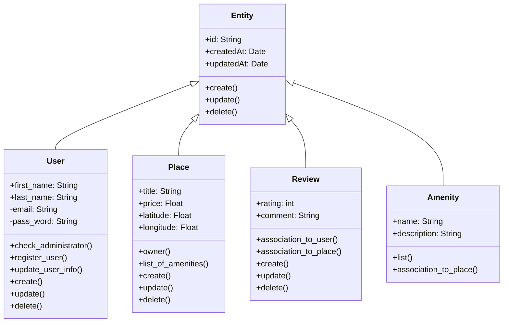

```mermaid

classDiagram

	class Entity {
		+id: String
		+createdAt: Date
		+updatedAt: Date
		+create()
		+update()
		+delete()
	}

	class User {
		+first_name: String
		+last_name: String
		-email: String
		-pass_word: String

		+check_administrator()
		+register_user()
		+update_user_info()
		+create()
		+update()
		+delete()
	}

	class Place {
		+title: String
		+price: Float
		+latitude: Float
		+longitude: Float

		+owner()
		+list_of_amenities()
		+create()
		+update()
		+delete()
	}

	class Review {
		+rating: int
		+comment: String

		+association_to_user()
		+association_to_place()
		+create()
		+update()
		+delete()
	}

	class Amenity {
		+name: String
		+description: String

		+list()
		+association_to_place()
	}

	Entity <|-- User
	Entity <|-- Place
	Entity <|-- Review
	Entity <|-- Amenity

```

