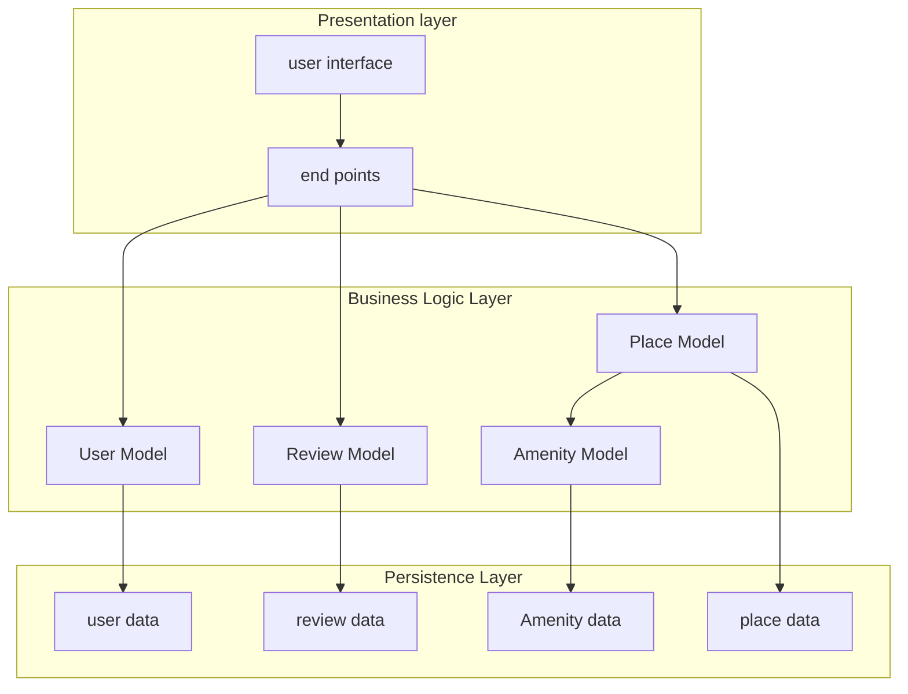

```mermaid

graph TD;

	subgraph Presentation layer
		UI[user interface]
		API[end points]
	end

	subgraph Business Logic Layer
		User[User Model]
		Place[Place Model]
		Review[Review Model]
		Amenity[Amenity Model]
	end

	subgraph Persistence Layer
		User_repo[user data]
		Place_repo[place data]
		Review_repo[review data]
		Amenity_repo[Amenity data]
	end

	UI --> API

	API --> User
	API --> Review
	API --> Place
	Place --> Amenity


	User --> User_repo
	Place --> Place_repo
	Review --> Review_repo
	Amenity --> Amenity_repo

```
