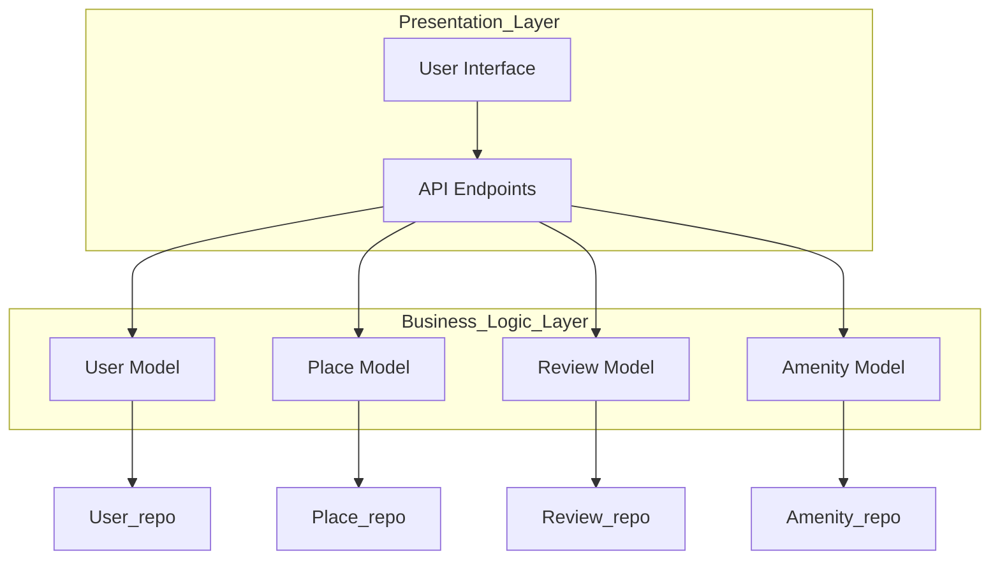

```mermaid
graph TD;

    subgraph Presentation_Layer
        UI[User Interface]
        API[API Endpoints]
    end

    subgraph Business_Logic_Layer
        User[User Model]
        Place[Place Model]
        Review[Review Model]
        Amenity[Amenity Model]
    end

	    UI --> API
    API --> User
    API --> Place
    API --> Review
    API --> Amenity

    User --> User_repo
    Place --> Place_repo
    Review --> Review_repo
    Amenity --> Amenity_repo

```
